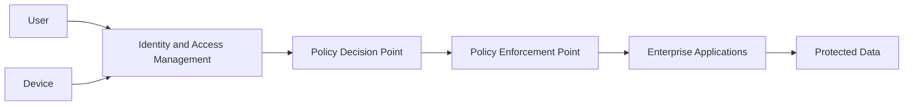
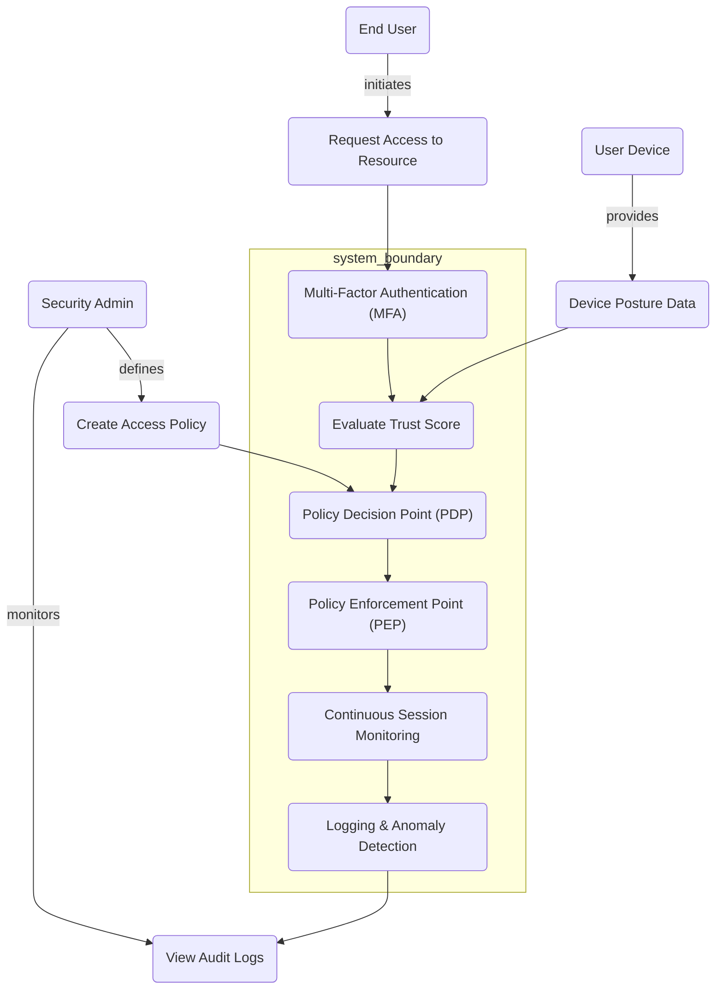
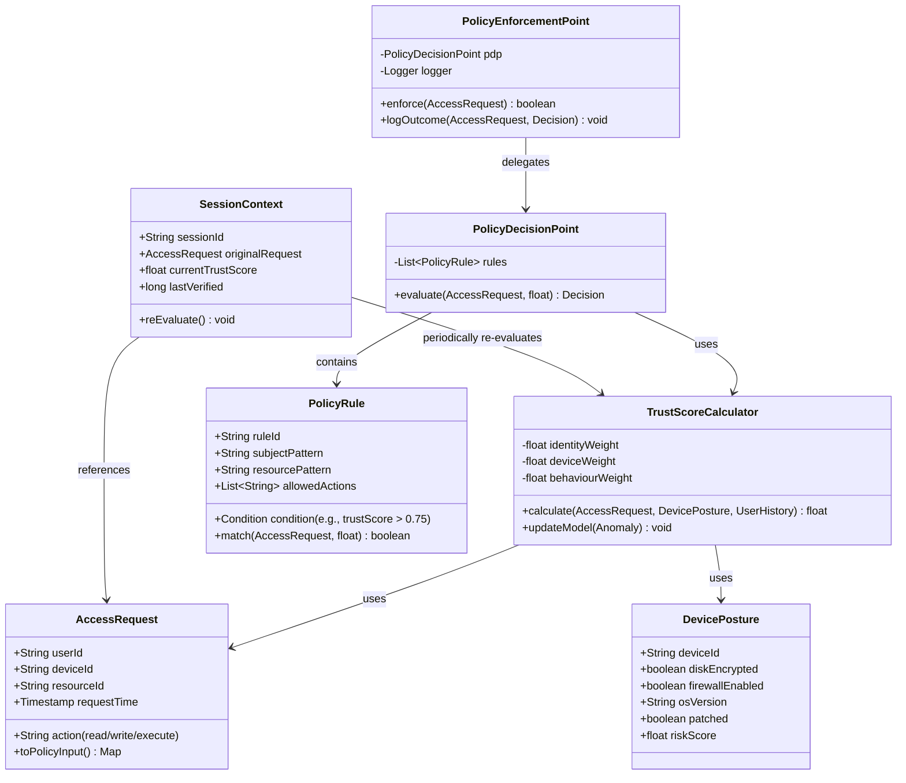
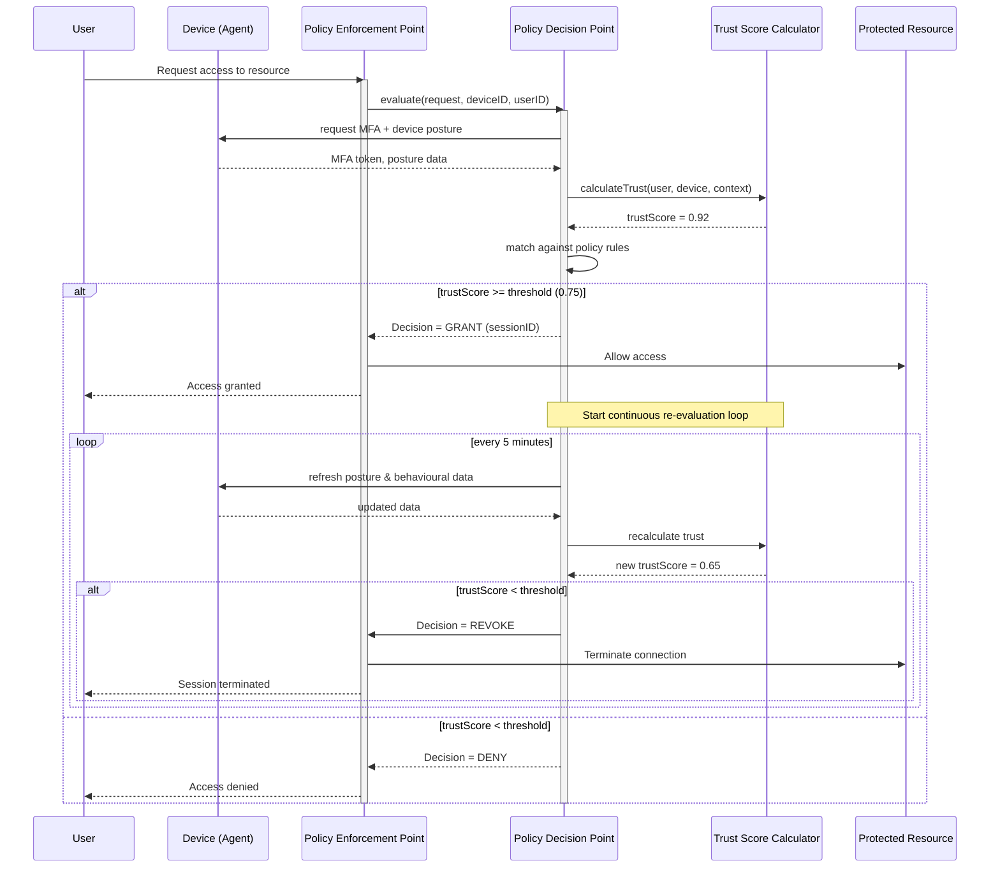
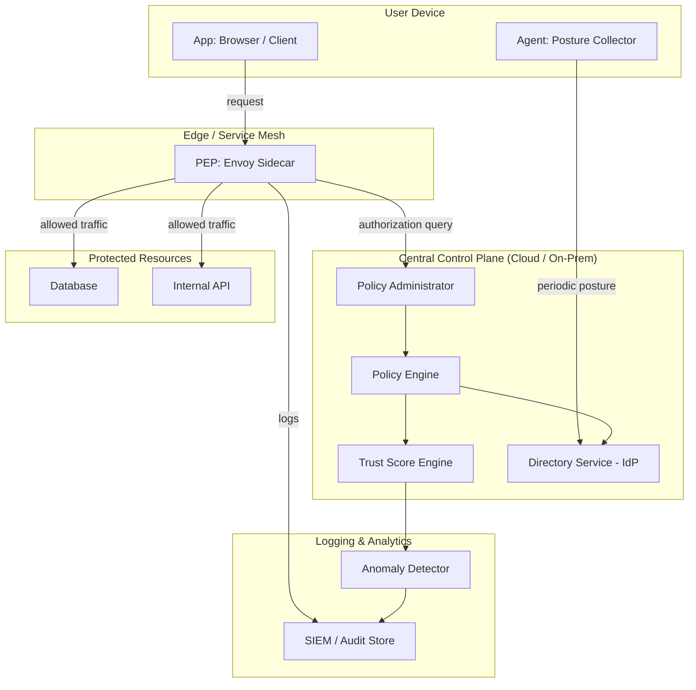

# Strategies and best practices for zero trust architecture - Diagrams
## High-level zero trust architecture

### Explanation
This diagram presents the fundamental structure of a Zero Trust Architecture (ZTA). Unlike traditional perimeter-based security models, ZTA assumes that no user, device, or application should be trusted by default. Every access request must undergo authentication, authorization, and continuous verification before access is granted.
The Identity and Access Management (IAM) system verifies identities and device posture. The Policy Decision Point evaluates contextual information and security policies, while the Policy Enforcement Point controls access to enterprise resources. This diagram establishes the conceptual foundation of the dissertation 
because all subsequent strategies and best practices are based on these core components.

## Use case diagram (zero trust access request)

### Explanation
It captures the high‑level functional requirements of a zero trust architecture (ZTA) from an actor perspective. It shows how a user, device, and administrator interact with the core zero trust components: policy decision point (PDP), policy enforcement point (PEP), and continuous monitoring.
The diagram includes the main use cases for ZTA: requesting access to a resource, performing multi‑factor authentication (MFA), device posture assessment, generating a trust score, enforcing least‑privilege access, and logging all actions for audit.

This diagram serves as the functional baseline. It illustrates that ZTA is not just about authentication but about continuous verification, context‑aware policy, and micro‑segmentation. It supports the thesis argument that best practices must address all these use cases.

## Class diagram (policy engine and trust evaluator)

### Explanation
The class diagram provides a blueprint for implementing a ZTA prototype. It demonstrates how the thesis translates abstract principles (e.g., “never trust, always verify”) into concrete software components.
It represents the static structure of a software implementation of the core zero trust logic: policy rules, trust scores, session context, and enforcement.

The diagram includes main classes:
- AccessRequest (user, device, resource, time),
- TrustScoreCalculator (combines identity, device health, behavioural anomalies),
- PolicyRule (subject, action, resource, condition),
- PolicyDecisionPoint (evaluates rules against request),
- PolicyEnforcementPoint (grants/denies and logs),
- SessionContext (maintains continuous trust during a session).

## Sequence diagram (continuous verification flow)

### Explanation
This sequence diagram is the heart of the zero trust demonstration. It visually proves that the architecture is not a one‑time authentication but a continuous, context‑aware process. It shows the dynamic interactions during a typical zero trust access attempt, including initial verification and periodic re‑evaluation during the session.

The diagram follows a complete scenario:
1. User requests access to an internal database.
2. PEP asks PDP for a decision.
3. PDP requests authentication (MFA) and device posture from the user’s device.
4. Trust score is calculated.
5. If above threshold, access is granted and a session context is created.
6. While the session is active, the PDP periodically re‑evaluates trust (e.g., every 5 minutes). If trust drops (e.g., device becomes non‑compliant), the session is terminated.

## Component and deployment diagram (zero trust reference architecture)

### Explanation
This deployment diagram demonstrates how zero trust components can be integrated within a modern enterprise environment. The architecture combines a component diagram (for logical separation) and a deployment diagram (for runtime nodes). It clarifies the separation of control plane (policy) from data plane (enforcement) – a key best practice.

Logical components (based on NIST SP 800‑207):
- Policy Engine (PE) – makes decisions.
- Policy Administrator (PA) – pushes decisions to PEP.
- Policy Enforcement Point (PEP) – intercepts and enforces traffic.
- Trust Score Engine – continuous evaluation.
- Logging & Analytics – audit and anomaly detection.

Deployment nodes:
- End‑user device (runs agent for posture collection)
- Edge PEP (e.g., sidecar or gateway)
- Central Policy Server (hosts PE, PA, Trust Engine)
- SIEM node (logging)

This diagram is particularly relevant to the dissertation because many of the analyzed case studies (e.g., Google BeyondCorp and U.S. Department of Defense initiatives) rely on similar architectural principles.

## References
> [1] S. Rose, O. Borchert, S. Mitchell, and S. Connelly, “Zero trust architecture,” NIST Special Publication 800-207, vol. 1, no. 800–207, Aug. 2020, doi: 10.6028/nist.sp.800-207.

> [2] N. F. Syed, S. W. Shah, A. Shaghaghi, A. Anwar, Z. Baig and R. Doss, "Zero Trust Architecture (ZTA): A Comprehensive Survey," in IEEE Access, vol. 10, pp. 57143-57179, 2022, doi: 10.1109/ACCESS.2022.3174679.

> [3] Rajender Pell Reddy, "Zero Trust Architectures in Modern Enterprises: Principles, Implementation Challenges, and Best Practices," International Journal of Computer Trends and Technology (IJCTT), vol. 73, no. 6, pp. 48-57, 2025. Crossref, https://doi.org/10.14445/22312803/IJCTT-V73I6P107

> [4] Mushtaq, S.; Mohsin, M.;Mushtaq, M.M. "A Systematic Literature Review on the Implementation and Challenges of Zero Trust Architecture Across Domains," Sensors 2025, 25, 6118, https://doi.org/10.3390/s25196118

> [5] E. B. Fernandez and A. Brazhuk, “A critical analysis of Zero Trust Architecture (ZTA),” Computer Standards & Interfaces, vol. 89, p. 103832, Apr. 2024, doi: 10.1016/j.csi.2024.103832.
‌
